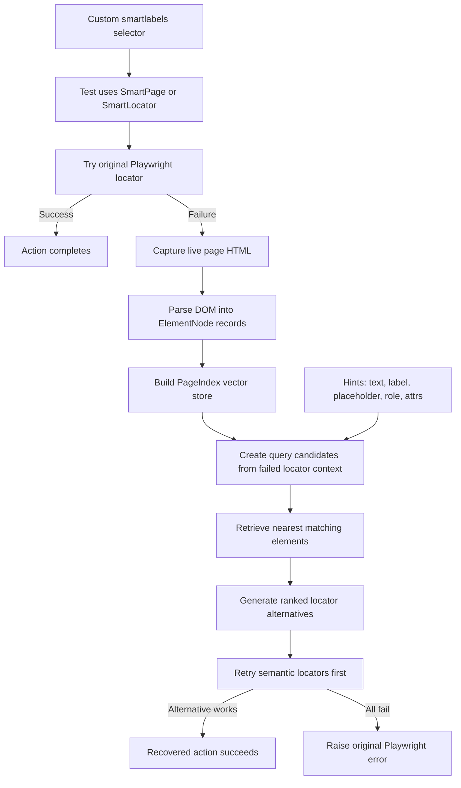
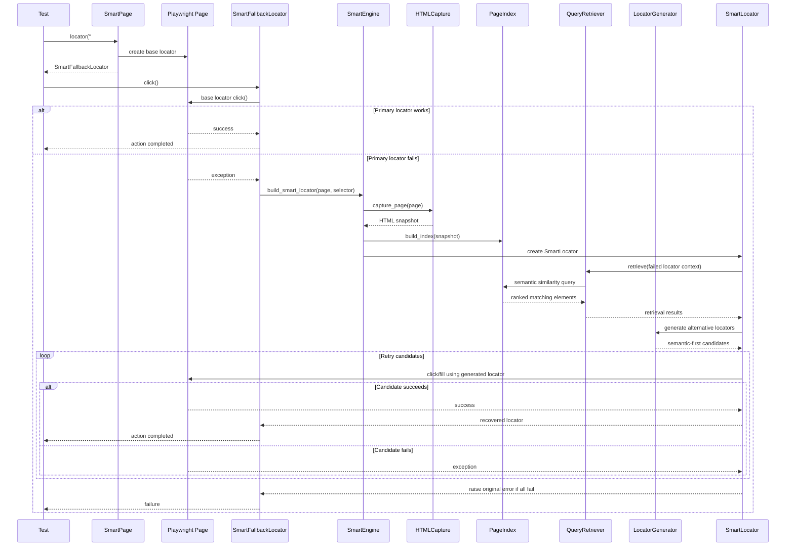

# Playwright PageIndex Retry Strategy

## Project Structure

```
playwright-with-pageindex/
├── src/
│   ├── __init__.py
│   └── core/
│       ├── __init__.py
│       └── html_capture.py           # Step 1: HTML Capture Module
├── tests/
│   └── test_step1_html_capture.py   # Tests for Step 1
├── .github/
│   └── skills/
│       └── playwright-pageindex-retry/
│           └── SKILL.md              # Project plan and architecture
├── requirements.txt
└── README.md
```

## Setup

Detailed design and implementation approach live in [`.github/skills/playwright-pageindex-retry/SKILL.md`](.github/skills/playwright-pageindex-retry/SKILL.md).

```bash
pip install -r requirements.txt
playwright install
```

## RAG Flow Diagram

This diagram shows the failure-only recovery path used by the SmartLocator/PageIndex pipeline.



## Runtime Sequence Diagram

This diagram shows what happens at runtime when a normal Playwright action fails and the recovery pipeline takes over.



## Real Usage In Playwright Tests

The intended usage is:

- test files contain only Playwright-style commands
- internal SmartLocator fallback is triggered automatically when a normal locator fails
- explicit fallback usage is available through `page.smartlocator(texts=[...])`

### Fixture Setup

Create a fixture that registers the custom selector and wraps the Playwright page with `SmartPage`.

`tmp_path` is a built-in pytest fixture that provides a fresh temporary directory for each test run; it is used here to store the runtime PageIndex files safely per test.

```python
import pytest_asyncio
from playwright.async_api import async_playwright

from src.core import (
    SmartEngine,
    SmartLocatorConfig,
    SmartPage,
    register_smartlabels_selector,
)


@pytest_asyncio.fixture
async def smart_page(tmp_path):
    async with async_playwright() as p:
        await register_smartlabels_selector(p)

        browser = await p.chromium.launch(headless=True)
        page = await browser.new_page()

        engine = SmartEngine(
            persist_directory=str(tmp_path / "smart_runtime_index"),
            smart_config=SmartLocatorConfig(max_alternative_attempts=4, action_timeout_ms=1500),
        )

        yield SmartPage(page, engine)

        await browser.close()
```

### Example Test

Sample test is here [`tests/myapp/test_register.py`](tests/myapp/test_register.py).

## Run MyApp Tests

```bash
pip install -r requirements.txt
playwright install
pytest -q tests/myapp -v
```

### Sample report

